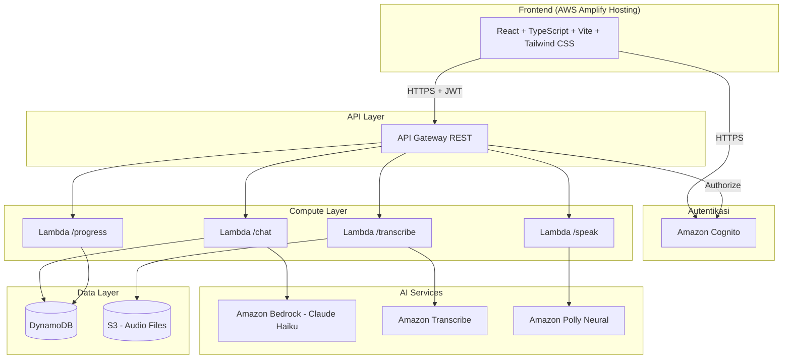
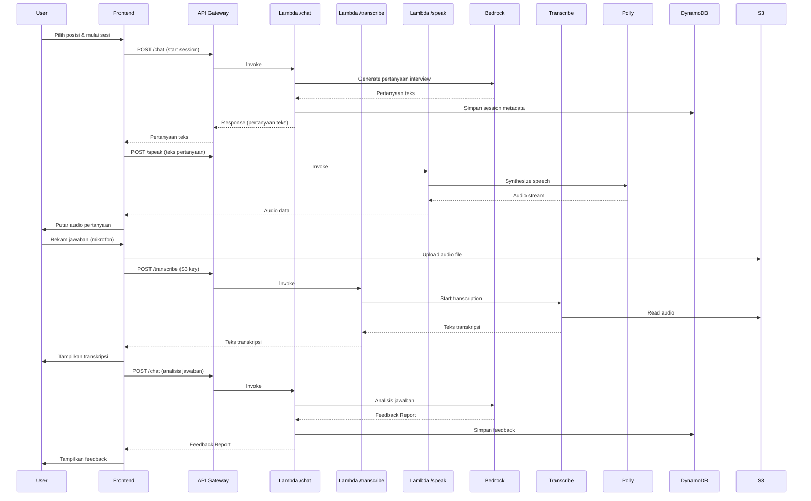

# Dokumen Desain - English Learning App

## Overview

Aplikasi English Learning App adalah platform web untuk persiapan interview kerja dalam bahasa Inggris. Aplikasi ini terdiri dari tiga modul utama: Speaking (simulasi interview dengan AI), Grammar (quiz multiple choice), dan Writing (latihan menulis dengan AI review). Arsitektur menggunakan pendekatan serverless di AWS dengan React + TypeScript di frontend dan AWS CDK untuk infrastructure as code.

Keputusan desain utama:
- **Serverless-first**: Semua backend menggunakan AWS Lambda + API Gateway untuk skalabilitas dan efisiensi biaya
- **AI-powered**: Amazon Bedrock (Claude Haiku) sebagai engine utama untuk analisis bahasa, generate pertanyaan, dan feedback
- **Real-time speech processing**: Amazon Transcribe untuk speech-to-text dan Amazon Polly (Neural voices) untuk text-to-speech
- **Single Page Application**: React + Vite + Tailwind CSS untuk pengalaman pengguna yang responsif

## Architecture

### Diagram Arsitektur Tingkat Tinggi



### Alur Data Utama - Speaking Module



## Components and Interfaces

### 1. Frontend Components (React + TypeScript)

#### Struktur Komponen

```
src/
├── components/
│   ├── auth/
│   │   ├── LoginForm.tsx          # Form login dengan email/password
│   │   ├── RegisterForm.tsx       # Form registrasi
│   │   └── ProtectedRoute.tsx     # Route guard untuk autentikasi
│   ├── dashboard/
│   │   ├── Dashboard.tsx          # Halaman utama dengan 3 modul
│   │   ├── ModuleCard.tsx         # Card untuk setiap modul dengan progress
│   │   └── ProgressOverview.tsx   # Ringkasan progress di dashboard
│   ├── speaking/
│   │   ├── SpeakingModule.tsx     # Container utama speaking module
│   │   ├── JobPositionSelector.tsx # Pemilihan posisi pekerjaan
│   │   ├── InterviewSession.tsx   # Sesi interview aktif
│   │   ├── AudioRecorder.tsx      # Komponen perekaman audio
│   │   ├── TranscriptionDisplay.tsx # Tampilan hasil transkripsi
│   │   ├── FeedbackDisplay.tsx    # Tampilan feedback AI
│   │   └── SummaryReport.tsx      # Laporan akhir sesi
│   ├── grammar/
│   │   ├── GrammarModule.tsx      # Container utama grammar module
│   │   ├── TopicSelector.tsx      # Pemilihan topik grammar
│   │   ├── QuizQuestion.tsx       # Tampilan soal quiz
│   │   └── QuizExplanation.tsx    # Penjelasan jawaban
│   ├── writing/
│   │   ├── WritingModule.tsx      # Container utama writing module
│   │   ├── WritingTypeSelector.tsx # Pemilihan tipe tulisan
│   │   ├── WritingEditor.tsx      # Editor teks untuk menulis
│   │   └── WritingReview.tsx      # Tampilan review AI
│   └── progress/
│       ├── ProgressPage.tsx       # Halaman progress lengkap
│       └── ProgressChart.tsx      # Grafik tren skor
├── hooks/
│   ├── useAuth.ts                 # Hook untuk autentikasi Cognito
│   ├── useAudioRecorder.ts        # Hook untuk perekaman audio
│   └── useApi.ts                  # Hook untuk API calls
├── services/
│   ├── apiClient.ts               # HTTP client dengan JWT token
│   ├── authService.ts             # Wrapper Amazon Cognito
│   └── audioService.ts            # Upload audio ke S3
├── types/
│   └── index.ts                   # TypeScript type definitions
└── App.tsx                        # Root component dengan routing
```

#### Interface API Client

```typescript
interface ApiClient {
  chat(request: ChatRequest): Promise<ChatResponse>;
  transcribe(audioKey: string): Promise<TranscriptionResponse>;
  speak(text: string): Promise<AudioData>;
  getProgress(userId: string): Promise<ProgressData>;
  updateProgress(data: ProgressUpdate): Promise<void>;
}

interface ChatRequest {
  sessionId?: string;
  action: 'start_session' | 'analyze_answer' | 'next_question' | 'end_session' | 'grammar_quiz' | 'grammar_explain' | 'writing_prompt' | 'writing_review';
  jobPosition?: string;
  transcription?: string;
  grammarTopic?: string;
  selectedAnswer?: string;
  writingType?: 'essay' | 'email';
  writingContent?: string;
}

interface ChatResponse {
  sessionId: string;
  type: 'question' | 'feedback' | 'summary' | 'quiz' | 'explanation' | 'writing_prompt' | 'writing_review';
  content: string;
  feedbackReport?: FeedbackReport;
  summaryReport?: SummaryReport;
  quizData?: QuizData;
  writingReview?: WritingReviewData;
}
```

### 2. Backend Components (AWS Lambda)

#### Lambda /chat
- **Trigger**: API Gateway POST /chat
- **Tanggung jawab**: Mengelola semua interaksi AI melalui Amazon Bedrock
- **Actions yang didukung**:
  - `start_session`: Membuat sesi interview baru, generate pertanyaan pertama
  - `analyze_answer`: Menganalisis jawaban user dan menghasilkan feedback
  - `next_question`: Generate pertanyaan berikutnya dalam sesi
  - `end_session`: Mengakhiri sesi dan generate summary report
  - `grammar_quiz`: Generate soal quiz grammar
  - `grammar_explain`: Generate penjelasan jawaban grammar
  - `writing_prompt`: Generate prompt tulisan
  - `writing_review`: Menganalisis dan review tulisan user

#### Lambda /transcribe
- **Trigger**: API Gateway POST /transcribe
- **Tanggung jawab**: Mengelola proses speech-to-text
- **Alur**: Menerima S3 key audio → Start Amazon Transcribe job → Poll hasil → Return transkripsi

#### Lambda /speak
- **Trigger**: API Gateway POST /speak
- **Tanggung jawab**: Mengelola proses text-to-speech
- **Alur**: Menerima teks → Call Amazon Polly (Neural voice) → Return audio stream (base64)

#### Lambda /progress
- **Trigger**: API Gateway GET/POST /progress
- **Tanggung jawab**: Mengelola data progress user
- **GET**: Mengambil statistik dan riwayat progress user
- **POST**: Menyimpan/update data progress setelah aktivitas pembelajaran

### 3. Infrastructure (AWS CDK)

```
infra/
├── bin/
│   └── app.ts                     # CDK app entry point
├── lib/
│   ├── auth-stack.ts              # Cognito User Pool & Client
│   ├── api-stack.ts               # API Gateway + Lambda functions
│   ├── storage-stack.ts           # DynamoDB tables + S3 bucket
│   └── frontend-stack.ts          # Amplify Hosting configuration
└── cdk.json
```

#### Interface antar Stack

```typescript
// Auth Stack exports
interface AuthStackOutputs {
  userPoolId: string;
  userPoolClientId: string;
  userPoolArn: string;
}

// Storage Stack exports
interface StorageStackOutputs {
  sessionsTableName: string;
  progressTableName: string;
  audioBucketName: string;
  audioBucketArn: string;
}

// API Stack inputs
interface ApiStackProps {
  auth: AuthStackOutputs;
  storage: StorageStackOutputs;
}
```

## Data Models

### DynamoDB Tables

#### 1. Sessions Table

Menyimpan data sesi interview, quiz grammar, dan latihan writing.

```
Table Name: EnglishLearningApp-Sessions
Partition Key: userId (String)
Sort Key: sessionId (String)
GSI: sessionId-index (Partition: sessionId)

{
  userId: string;              // Cognito user sub
  sessionId: string;           // UUID v4
  type: 'speaking' | 'grammar' | 'writing';
  status: 'active' | 'completed';
  createdAt: string;           // ISO 8601
  updatedAt: string;           // ISO 8601

  // Speaking-specific
  jobPosition?: string;
  questions?: Array<{
    questionId: string;
    questionText: string;
    transcription?: string;
    audioS3Key?: string;
    feedback?: FeedbackReport;
    answeredAt?: string;
  }>;
  summaryReport?: SummaryReport;

  // Grammar-specific
  grammarTopic?: string;
  quizResults?: Array<{
    questionId: string;
    question: string;
    options: string[];
    correctAnswer: string;
    userAnswer: string;
    isCorrect: boolean;
    explanation: string;
  }>;

  // Writing-specific
  writingType?: 'essay' | 'email';
  writingPrompt?: string;
  userWriting?: string;
  writingReview?: WritingReviewData;
}
```

#### 2. Progress Table

Menyimpan data progress agregat per user per modul.

```
Table Name: EnglishLearningApp-Progress
Partition Key: userId (String)
Sort Key: moduleType (String) // 'speaking' | 'grammar' | 'writing' | 'overall'

{
  userId: string;
  moduleType: string;
  totalSessions: number;
  averageScore: number;
  lastActivityAt: string;      // ISO 8601

  // Speaking progress
  speakingScores?: {
    grammar: number;
    vocabulary: number;
    relevance: number;
    fillerWords: number;
    coherence: number;
  };

  // Grammar progress
  topicScores?: Record<string, {
    totalQuestions: number;
    correctAnswers: number;
    accuracy: number;
  }>;

  // Writing progress
  writingScores?: {
    grammarCorrectness: number;
    structure: number;
    vocabulary: number;
  };

  // Riwayat skor untuk grafik tren
  scoreHistory: Array<{
    date: string;
    score: number;
    sessionId: string;
  }>;
}
```

### TypeScript Type Definitions

```typescript
interface FeedbackReport {
  scores: {
    grammar: number;           // 0-100
    vocabulary: number;        // 0-100
    relevance: number;         // 0-100
    fillerWords: number;       // 0-100 (higher = fewer filler words)
    coherence: number;         // 0-100
    overall: number;           // 0-100 (weighted average)
  };
  grammarErrors: Array<{
    original: string;
    correction: string;
    rule: string;
  }>;
  fillerWordsDetected: Array<{
    word: string;
    count: number;
  }>;
  suggestions: string[];
  improvedAnswer: string;
}

interface SummaryReport {
  overallScore: number;
  criteriaScores: {
    grammar: number;
    vocabulary: number;
    relevance: number;
    fillerWords: number;
    coherence: number;
  };
  performanceTrend: Array<{
    questionNumber: number;
    score: number;
  }>;
  topImprovementAreas: string[];  // Top 3
  recommendations: string[];
}

interface QuizData {
  questionId: string;
  question: string;
  options: string[];
  correctAnswer: string;
}

interface WritingReviewData {
  overallScore: number;        // 0-100
  aspects: {
    grammarCorrectness: {
      score: number;
      errors: Array<{
        text: string;
        correction: string;
        explanation: string;
      }>;
    };
    structure: {
      score: number;
      feedback: string;
    };
    vocabulary: {
      score: number;
      suggestions: string[];
    };
  };
}

interface ProgressData {
  speaking: {
    totalSessions: number;
    averageScore: number;
    scoreHistory: Array<{ date: string; score: number }>;
  };
  grammar: {
    totalQuizzes: number;
    topicScores: Record<string, { accuracy: number }>;
  };
  writing: {
    totalReviews: number;
    averageScore: number;
    scoreHistory: Array<{ date: string; score: number }>;
  };
}
```

### S3 Storage Structure

```
s3://english-learning-app-audio/
├── {userId}/
│   ├── {sessionId}/
│   │   ├── {questionId}.webm    # Audio rekaman user
│   │   └── {questionId}.json    # Metadata transkripsi
```

## Correctness Properties

*Property adalah karakteristik atau perilaku yang harus berlaku di semua eksekusi valid dari sebuah sistem — pada dasarnya, pernyataan formal tentang apa yang harus dilakukan sistem. Property berfungsi sebagai jembatan antara spesifikasi yang dapat dibaca manusia dan jaminan kebenaran yang dapat diverifikasi mesin.*

### Property 1: Pesan error autentikasi tidak membocorkan informasi kredensial

*Untuk setiap* kombinasi email dan password yang tidak valid (email salah, password salah, atau keduanya salah), pesan error yang dikembalikan oleh Auth_Service harus selalu berupa pesan generik yang sama ("Email atau password salah") tanpa mengungkapkan kredensial mana yang salah.

**Validates: Requirements 1.3**

### Property 2: Token logout menjadi tidak valid

*Untuk setiap* token akses yang valid, setelah operasi logout dilakukan, token tersebut harus ditolak oleh API_Gateway pada request berikutnya.

**Validates: Requirements 1.4**

### Property 3: API menolak request tanpa token valid

*Untuk setiap* request ke endpoint yang memerlukan autentikasi (/chat, /transcribe, /speak, /progress), jika request tidak menyertakan token autentikasi yang valid, API_Gateway harus mengembalikan HTTP status 401 Unauthorized.

**Validates: Requirements 1.5, 12.1**

### Property 4: Pembuatan sesi interview menyimpan metadata dengan benar

*Untuk setiap* posisi pekerjaan yang valid yang dipilih oleh user, sistem harus membuat Interview_Session baru di Database dengan metadata yang benar (userId, sessionId, jobPosition, status='active', timestamp), dan session tersebut harus dapat di-retrieve kembali dengan data yang sama.

**Validates: Requirements 3.2**

### Property 5: Text-to-speech menghasilkan audio valid

*Untuk setiap* teks pertanyaan interview yang non-empty, Speech_Service (Amazon Polly) harus mengembalikan data audio yang valid (non-empty byte array) yang dapat di-decode.

**Validates: Requirements 3.4**

### Property 6: Upload audio menghasilkan S3 key yang valid

*Untuk setiap* audio blob yang direkam oleh user, setelah upload ke S3, sistem harus mengembalikan S3 key yang valid dan file harus dapat di-retrieve kembali dari S3 menggunakan key tersebut.

**Validates: Requirements 4.3**

### Property 7: Transkripsi menghasilkan teks bahasa Inggris

*Untuk setiap* file audio yang valid di S3, Transcription_Service harus mengembalikan hasil transkripsi berupa string non-empty dalam bahasa Inggris.

**Validates: Requirements 4.4**

### Property 8: FeedbackReport memiliki struktur lengkap dengan skor valid

*Untuk setiap* teks transkripsi jawaban user yang non-empty, FeedbackReport yang dihasilkan oleh AI_Engine harus berisi: skor numerik dalam rentang 0-100 untuk kelima kriteria (grammar, vocabulary, relevance, fillerWords, coherence), daftar grammarErrors (bisa kosong), daftar fillerWordsDetected (bisa kosong), array suggestions yang non-empty, dan string improvedAnswer yang non-empty.

**Validates: Requirements 5.1, 5.2**

### Property 9: FeedbackReport tersimpan dan terkait dengan sesi yang benar

*Untuk setiap* FeedbackReport yang dihasilkan, setelah disimpan ke Database, report tersebut harus dapat di-retrieve kembali menggunakan sessionId dan questionId yang benar, dengan data yang identik.

**Validates: Requirements 5.4**

### Property 10: Pertanyaan interview dalam satu sesi tidak berulang

*Untuk setiap* Interview_Session dengan N pertanyaan (N > 1), semua pertanyaan dalam sesi tersebut harus unik — tidak ada dua pertanyaan yang memiliki teks yang sama.

**Validates: Requirements 6.2**

### Property 11: SummaryReport memiliki struktur lengkap

*Untuk setiap* Interview_Session yang telah selesai (minimal 1 pertanyaan dijawab), SummaryReport yang dihasilkan harus berisi: overallScore (0-100), skor per kriteria (5 kriteria), performanceTrend dengan jumlah entry sama dengan jumlah pertanyaan yang dijawab, tepat 3 topImprovementAreas, dan array recommendations yang non-empty.

**Validates: Requirements 7.1**

### Property 12: SummaryReport tersimpan dan terkait dengan user

*Untuk setiap* SummaryReport yang dihasilkan, setelah disimpan ke Database, report tersebut harus dapat di-retrieve menggunakan userId dan sessionId, dengan data yang identik.

**Validates: Requirements 7.3**

### Property 13: Quiz grammar menghasilkan soal dengan 4 pilihan dan 1 jawaban benar

*Untuk setiap* topik grammar yang valid, soal quiz yang dihasilkan oleh AI_Engine harus memiliki tepat 4 pilihan jawaban, dan tepat 1 dari pilihan tersebut harus ditandai sebagai jawaban yang benar.

**Validates: Requirements 8.2**

### Property 14: Validasi jawaban quiz mengembalikan hasil yang benar

*Untuk setiap* soal quiz dan jawaban yang dipilih user, sistem harus mengembalikan `isCorrect = true` jika dan hanya jika jawaban yang dipilih sama dengan correctAnswer.

**Validates: Requirements 8.3**

### Property 15: Penjelasan jawaban quiz selalu tersedia

*Untuk setiap* soal quiz yang telah dijawab, AI_Engine harus menghasilkan penjelasan (explanation) berupa string non-empty yang menyebutkan aturan grammar yang berlaku.

**Validates: Requirements 8.4**

### Property 16: Progress grammar tersimpan per topik

*Untuk setiap* quiz grammar yang diselesaikan, skor dan progress harus tersimpan di Database dan dapat di-retrieve dengan data yang benar (totalQuestions, correctAnswers, accuracy) untuk topik yang bersangkutan.

**Validates: Requirements 8.5**

### Property 17: WritingReview memiliki struktur lengkap dengan skor valid

*Untuk setiap* tulisan user yang non-empty, WritingReview yang dihasilkan oleh AI_Engine harus berisi: overallScore dalam rentang 0-100, skor untuk ketiga aspek (grammarCorrectness, structure, vocabulary) masing-masing dalam rentang 0-100, dan saran koreksi spesifik untuk setiap kesalahan yang ditemukan.

**Validates: Requirements 9.3, 9.4**

### Property 18: Tulisan dan review tersimpan di Database

*Untuk setiap* tulisan user yang telah di-review, tulisan asli dan WritingReview harus tersimpan di Database dan dapat di-retrieve menggunakan sessionId dengan data yang identik.

**Validates: Requirements 9.5**

### Property 19: Statistik progress dihitung dengan benar

*Untuk setiap* user dengan riwayat aktivitas, statistik progress yang ditampilkan (total sesi, rata-rata skor, jumlah quiz, jumlah tulisan) harus konsisten dengan data aktivitas yang tersimpan di Database.

**Validates: Requirements 10.1, 10.2**

### Property 20: Lambda response selalu dalam format JSON valid

*Untuk setiap* request yang valid ke salah satu dari 4 endpoint (/chat, /transcribe, /speak, /progress), response body yang dikembalikan oleh Lambda harus berupa JSON yang valid dan dapat di-parse.

**Validates: Requirements 11.2**

### Property 21: Error response memiliki HTTP status code dan pesan yang sesuai

*Untuk setiap* error yang terjadi di Lambda_Function, response harus memiliki HTTP status code yang sesuai (400 untuk client error, 500 untuk server error) dan body yang berisi pesan error deskriptif dalam format JSON.

**Validates: Requirements 11.4**

### Property 22: User hanya dapat mengakses data miliknya sendiri

*Untuk setiap* user A dan user B yang berbeda, ketika user A mencoba mengakses data milik user B (sesi, progress, audio), sistem harus menolak akses dan mengembalikan error 403 Forbidden.

**Validates: Requirements 12.2**

### Property 23: File audio di S3 hanya dapat diakses oleh pemiliknya

*Untuk setiap* file audio yang diunggah oleh user A, user B tidak boleh dapat mengakses atau mengunduh file tersebut dari S3.

**Validates: Requirements 12.3**

## Error Handling

### Strategi Error Handling per Layer

#### Frontend Error Handling

| Skenario | Handling | User Feedback |
|----------|----------|---------------|
| Network error / API tidak tersedia | Retry dengan exponential backoff (max 3x) | "Koneksi terputus. Mencoba ulang..." |
| Token expired | Refresh token otomatis via Cognito | Transparent, tidak ada notifikasi |
| Refresh token expired | Redirect ke halaman login | "Sesi Anda telah berakhir. Silakan login kembali." |
| Audio recording gagal (no permission) | Tampilkan instruksi izin mikrofon | "Izinkan akses mikrofon untuk merekam jawaban Anda." |
| Audio recording gagal (device error) | Tampilkan pesan error | "Mikrofon tidak terdeteksi. Periksa perangkat Anda." |
| AI analysis timeout (>30 detik) | Tampilkan opsi retry | "Analisis membutuhkan waktu lebih lama. Coba lagi?" |
| File upload gagal | Retry otomatis (max 3x) | "Gagal mengunggah rekaman. Mencoba ulang..." |

#### Backend Error Handling (Lambda)

| HTTP Status | Kondisi | Response Body |
|-------------|---------|---------------|
| 400 | Request body tidak valid / parameter missing | `{ "error": "Bad Request", "message": "..." }` |
| 401 | Token tidak valid atau expired | `{ "error": "Unauthorized", "message": "Token tidak valid" }` |
| 403 | User mencoba akses data user lain | `{ "error": "Forbidden", "message": "Akses ditolak" }` |
| 404 | Resource tidak ditemukan (session/data) | `{ "error": "Not Found", "message": "..." }` |
| 408 | Timeout dari Bedrock/Transcribe/Polly | `{ "error": "Request Timeout", "message": "..." }` |
| 500 | Internal server error | `{ "error": "Internal Server Error", "message": "Terjadi kesalahan internal" }` |

#### AWS Service Error Handling

| Service | Error Scenario | Handling |
|---------|---------------|----------|
| Amazon Bedrock | Rate limit / throttling | Retry dengan exponential backoff |
| Amazon Bedrock | Model tidak tersedia | Return 503 dengan pesan maintenance |
| Amazon Transcribe | Audio terlalu pendek (<1 detik) | Return 400 dengan pesan spesifik |
| Amazon Transcribe | Format audio tidak didukung | Return 400 dengan format yang didukung |
| Amazon Polly | Teks terlalu panjang | Truncate atau split teks |
| DynamoDB | Throughput exceeded | Retry dengan backoff |
| S3 | Upload gagal | Return 500 dengan instruksi retry |

### Validasi Input

Semua Lambda function harus memvalidasi input sebelum memproses:

```typescript
// Contoh validasi untuk /chat endpoint
interface ChatRequestValidation {
  sessionId: { required: boolean; format: 'uuid' };
  action: { required: true; enum: ['start_session', 'analyze_answer', ...] };
  jobPosition: { requiredIf: 'action === start_session' };
  transcription: { requiredIf: 'action === analyze_answer'; minLength: 1 };
}
```

## Testing Strategy

### Pendekatan Dual Testing

Aplikasi ini menggunakan dua pendekatan testing yang saling melengkapi:

1. **Unit Tests**: Memverifikasi contoh spesifik, edge cases, dan kondisi error
2. **Property-Based Tests**: Memverifikasi properti universal yang berlaku untuk semua input

### Library dan Tools

| Layer | Testing Framework | Property-Based Testing |
|-------|------------------|----------------------|
| Frontend (React) | Vitest + React Testing Library | fast-check |
| Backend (Lambda) | Jest | fast-check |
| Infrastructure (CDK) | Jest + CDK Assertions | - |
| E2E | Playwright | - |

### Konfigurasi Property-Based Testing

- Library: **fast-check** (untuk TypeScript/JavaScript)
- Minimum iterasi per property test: **100**
- Setiap property test harus memiliki tag komentar yang mereferensikan property di dokumen desain
- Format tag: `Feature: english-learning-app, Property {number}: {property_text}`
- Setiap correctness property harus diimplementasikan oleh **satu** property-based test

### Cakupan Testing

#### Unit Tests (Contoh Spesifik dan Edge Cases)

- **Auth**: Login sukses, registrasi sukses, validasi email format, password strength
- **Dashboard**: Render 3 modul, navigasi ke modul yang benar
- **Speaking Module**: Render daftar posisi pekerjaan, UI state transitions (idle → recording → processing → feedback)
- **Grammar Module**: Render daftar topik, tampilkan soal quiz, highlight jawaban benar/salah
- **Writing Module**: Render pilihan tipe tulisan, submit tulisan, tampilkan review
- **Progress**: Render statistik, render grafik tren
- **Error Handling**: Timeout handling, network error recovery, invalid input rejection
- **Edge Cases**: Audio terlalu pendek, tulisan kosong, sesi tanpa jawaban, transkripsi gagal

#### Property-Based Tests (Properti Universal)

Setiap property dari bagian Correctness Properties harus diimplementasikan sebagai property-based test menggunakan fast-check. Contoh implementasi:

```typescript
// Feature: english-learning-app, Property 8: FeedbackReport memiliki struktur lengkap dengan skor valid
import fc from 'fast-check';

test('FeedbackReport harus memiliki struktur lengkap dengan skor 0-100', () => {
  fc.assert(
    fc.property(
      fc.string({ minLength: 1 }), // transcription text
      async (transcription) => {
        const report = await analyzeSpeaking(transcription);
        // Semua skor harus dalam rentang 0-100
        expect(report.scores.grammar).toBeGreaterThanOrEqual(0);
        expect(report.scores.grammar).toBeLessThanOrEqual(100);
        // ... validasi semua field
        expect(report.suggestions.length).toBeGreaterThan(0);
        expect(report.improvedAnswer.length).toBeGreaterThan(0);
      }
    ),
    { numRuns: 100 }
  );
});
```

#### Integration Tests

- API Gateway → Lambda → DynamoDB round-trip
- Lambda → Amazon Bedrock (dengan mock untuk CI)
- Lambda → Amazon Transcribe (dengan mock untuk CI)
- Lambda → Amazon Polly (dengan mock untuk CI)
- S3 upload/download flow

#### E2E Tests (Playwright)

- Flow registrasi dan login lengkap
- Flow speaking module: pilih posisi → rekam → lihat feedback → summary
- Flow grammar module: pilih topik → jawab quiz → lihat penjelasan
- Flow writing module: pilih tipe → tulis → submit → lihat review
- Flow progress: lihat statistik dan grafik
